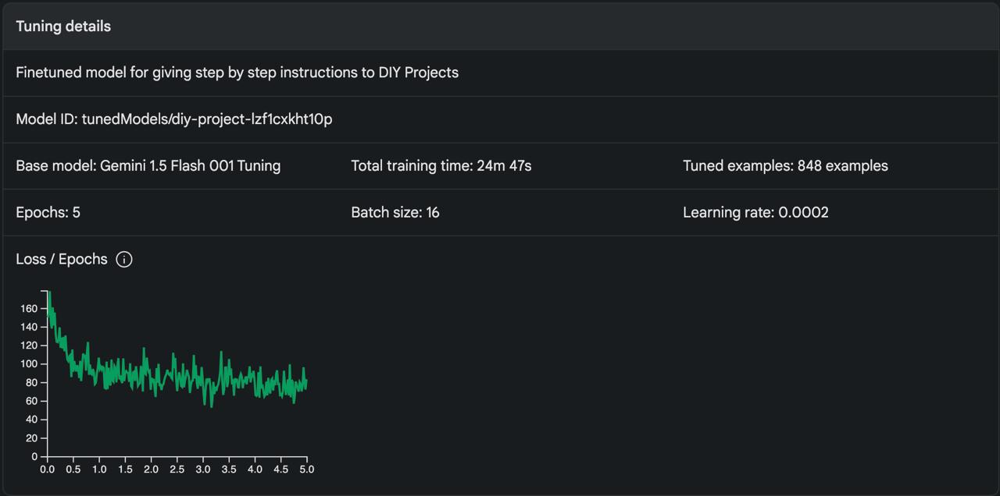
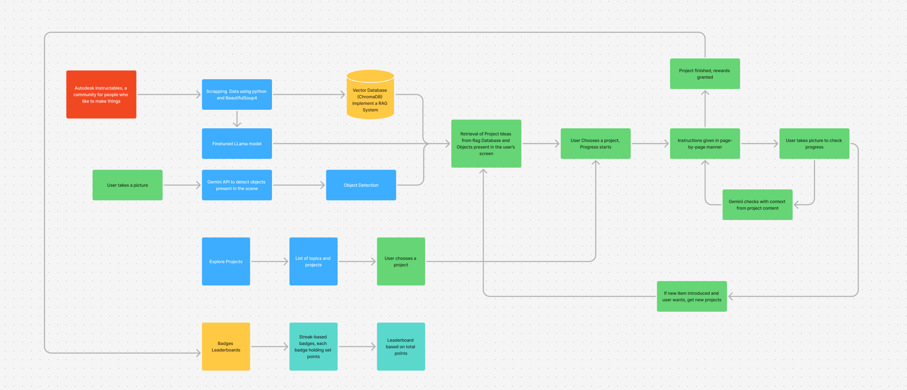

# Eunoia - AI-Powered DIY Learning Platform By Analysing User's Environment

**Eunoia** is an AI-powered platform designed to enhance **learning engagement through environmental interaction**. The system leverages **computer vision, Retrieval-Augmented Generation (RAG), and gamification** to help users repurpose physical materials into interactive, customizable learning experiences.

## 🔥 Hackathon Problem Statement - SNUC Hacks
**Learning Engagement Platform with Environmental Interaction**

- **Challenge**: Build an AI-powered platform that uses device cameras to analyze physical materials in a user’s environment and auto-generate interactive, novel learning experiences.
- **Goal**: Revolutionize how educators and learners transform real-world objects into engaging educational content.
- **Feature Ideas**:
  - **Collaborative Learning Zones** - Enable shared projects using combined resources.
  - **Skill-Based Gamification** - Reward progress and challenge completion with badges.
  - **Adaptive Content Suggestions** - Personalize educational content based on user learning styles.

## 🌟 Features
- **Web Scraping for DIY Projects**: Extracts DIY project data from [Instructables](https://www.instructables.com/) using `beautifulsoup4`, allowing users to explore hands-on projects effortlessly. This enables users to discover new ideas and get step-by-step guides for various DIY projects.

- **Object Recognition using AI**: Uses the **device camera** and **Gemini fine-tuning** to identify materials and suggest suitable DIY projects. By leveraging computer vision techniques and fine-tuned AI models, the platform ensures accurate material detection and relevant project recommendations.
- **Gemini Fine Tuning Details**:
  
  

- **Vector Search with ChromaDB**: Efficient storage and retrieval of project embeddings for better matching and personalized recommendations. ChromaDB allows quick lookups of DIY projects based on similarity, ensuring users receive the most relevant content based on their materials and interests.

- **Retrieval-Augmented Generation (RAG)**: Enhances AI-generated recommendations by integrating external DIY resources and user context. By leveraging RAG, the platform combines real-world data with generative AI to produce highly relevant and contextualized suggestions.

- **AI-Powered Recommendations**: Utilizes the **Gemini API** to generate interactive learning experiences based on user materials. The AI provides customized project ideas, explanations, and interactive elements to make learning more engaging and hands-on.

- **User Dashboard**:
  - **Tracks achievements 🏆**: Users can monitor their progress, earning badges and recognition for completing DIY projects and reaching learning milestones.
  - **Monitors ongoing DIY projects 📌**: Users can save and track ongoing projects, ensuring they can resume their learning journey at any time.

- **Explore Section**: Discover new and trending DIY projects. This section showcases popular projects, user-generated content, and AI-recommended DIY activities based on trends and user preferences.

- **Gamification Elements**: Users earn badges and rewards based on their learning progress. This system motivates learners by providing tangible goals, achievement levels, and incentives for engagement.

## 🏗️ System Design



## ⚙️ Tech Stack
### **Backend**
- **FastAPI** - API development & management
- **BeautifulSoup4** - Web scraping for DIY data
- **ChromaDB** - Vector database for efficient retrieval
- **Gemini API** - AI-powered recommendations
- **OpenCV & TensorFlow** - Object detection & material analysis
- **Retrieval-Augmented Generation (RAG)** - AI-enhanced contextual learning

### **Frontend**
- **React Native** - Cross-platform mobile application development

## 🚀 Installation & Setup
### **Backend Setup**
1. Clone the repository:
   ```sh
   git clone https://github.com/Try3D/Eunoia.git
   cd Eunoia
   ```
2. Set up a virtual environment:
   ```sh
   python -m venv env
   source env/bin/activate  # On Windows use `env\Scripts\activate`
   ```
3. Install dependencies:
   ```sh
   pip install -r requirements.txt
   ```
4. Run the FastAPI server:
   ```sh
   uvicorn main:app --reload
   ```

### **Frontend Setup**
1. Navigate to the frontend directory:
   ```sh
   cd frontend
   ```
2. Install dependencies:
   ```sh
   npm install
   ```
3. Start the React Native app:
   ```sh
   npm start
   ```


🚀 **Transform your everyday objects into learning experiences!**

