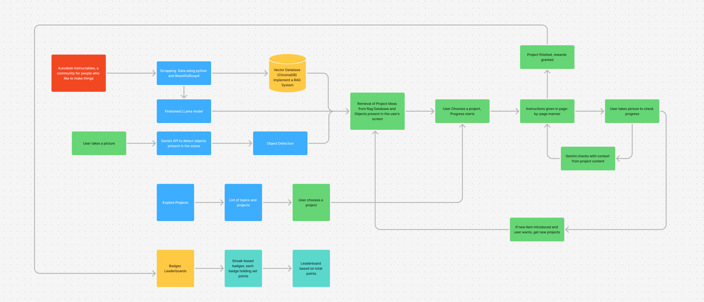

# Eunoia - AI-Powered DIY Learning Platform


**Eunoia** is an AI-powered platform designed to enhance **learning engagement through environmental interaction**. The system leverages **computer vision, Retrieval-Augmented Generation (RAG), and gamification** to help users repurpose physical materials into interactive, customizable learning experiences.

## 🔥 Hackathon Problem Statement - SNUC Hacks
**Learning Engagement Platform with Environmental Interaction**

- **Challenge**: Build an AI-powered platform that uses device cameras to analyze physical materials in a user’s environment and auto-generate interactive, novel learning experiences.
- **Goal**: Revolutionize how educators and learners transform real-world objects into engaging educational content.
- **Feature Ideas**:
  - **Collaborative Learning Zones** - Enable shared projects using combined resources.
  - **Skill-Based Gamification** - Reward progress and challenge completion with badges.
  - **Adaptive Content Suggestions** - Personalize educational content based on user learning styles.

## 🌟 Features
- **Web Scraping for DIY Projects**: Extracts DIY project data from [Instructables](https://www.instructables.com/) using `beautifulsoup4`.
- **Material Recognition using AI**: Uses the **device camera** and **Gemini fine-tuning** to analyze materials for suitable DIY recommendations.
- **Vector Search with ChromaDB**: Efficient storage and retrieval of project embeddings for better matching.
- **AI-Powered Recommendations**: Utilizes the **Gemini API** to generate interactive learning experiences based on user materials.
- **User Dashboard**:
  - Tracks achievements 🏆
  - Monitors ongoing DIY projects 📌
- **Explore Section**: Discover new and trending DIY projects.
- **Gamification Elements**: Users earn badges and rewards based on their learning progress.

## 🏗️ System Design



## ⚙️ Tech Stack
### **Backend**
- **FastAPI** - API development & management
- **BeautifulSoup4** - Web scraping for DIY data
- **ChromaDB** - Vector database for efficient retrieval
- **Gemini API** - AI-powered recommendations
- **OpenCV & TensorFlow** - Object detection & material analysis

### **Frontend**
- **React Native** - Cross-platform mobile application development

## 🚀 Installation & Setup
### **Backend Setup**
1. Clone the repository:
   ```sh
   git clone https://github.com/Try3D/Eunoia.git
   cd Eunoia
   ```
2. Set up a virtual environment:
   ```sh
   python -m venv env
   source env/bin/activate  # On Windows use `env\Scripts\activate`
   ```
3. Install dependencies:
   ```sh
   pip install -r requirements.txt
   ```
4. Run the FastAPI server:
   ```sh
   uvicorn main:app --reload
   ```

### **Frontend Setup**
1. Navigate to the frontend directory:
   ```sh
   cd frontend
   ```
2. Install dependencies:
   ```sh
   npm install
   ```
3. Start the React Native app:
   ```sh
   npm start
   ```
🚀 **Transform your everyday objects into learning experiences!**

