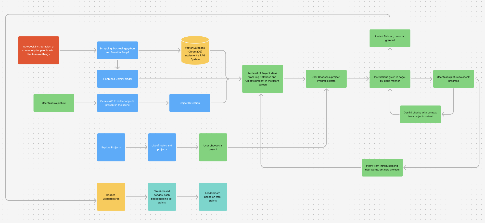

# Eunoia - AI-Powered DIY Learning Platform


**Eunoia** is an AI-powered platform designed to enhance **learning engagement** through **environmental interaction**. The system leverages **computer vision, Retrieval-Augmented Generation (RAG), and a gamified user interface** to help users repurpose objects at hand into tailored learning experiences.

## What have we done?
- **Web Scraping for DIY Projects**: Extracts DIY project data from [Instructables](https://www.instructables.com/) using `beautifulsoup4`, allowing users to explore hands-on projects effortlessly. This enables users to discover new ideas and get step-by-step guides for various DIY projects.

- **Object Recognition using AI**: Uses the **device camera** and a **fine-tuned Gemini model** to identify objects at hand and suggest suitable DIY projects for the user.
- **Gemini Fine Tuning Details**:
  
  

- **Vector Search with ChromaDB**: Efficient storage and retrieval of project embeddings for better matching and personalized recommendations. ChromaDB allows quick lookups of DIY projects based on similarity, ensuring users receive the most relevant content based on their materials and interests.

- **Retrieval-Augmented Generation (RAG)**: Enhances AI-generated recommendations by integrating external DIY resources and user context. By leveraging RAG, the platform combines real-world data with generative AI to produce highly relevant and contextualized suggestions.

- **AI-Powered Recommendations**: Utilizes the **Gemini API** to generate interactive learning experiences based on user materials. The AI provides customized project ideas, explanations, and interactive elements to make learning more engaging and hands-on. This ensures that the user isn't limited to existing projects but also newly-generated experiences.

- **User Dashboard**:
   - **Monitors ongoing DIY projects 📌**: Users can save and track ongoing projects, ensuring they can resume their learning journey at any time.
   - **Tracks achievements 🏆**: Users can monitor their progress, earning badges and recognition for completing DIY projects and reaching learning milestones.

- **Explore**: This tab helps users to look for freshly-generated projects in any topic of their choice, giving them a vast range to choose from.

- **Gamification**: Users earn badges and rewards based on their learning progress. This system motivates learners by providing tangible goals, achievement levels, and incentives for engagement.

## 🏗️ System Design



## ⚙️ Tech Stack
### **Backend**
- **FastAPI** - API development & management
- **BeautifulSoup4** - Web scraping for DIY data
- **ChromaDB** - Vector database for efficient retrieval
- **Gemini API** - Object Detection and AI-powered recommendations
- **Retrieval-Augmented Generation (RAG)** - AI-enhanced contextual learning

### **Frontend**
- **React Native** - Cross-platform mobile application development

## 🚀 Installation & Setup
### **Backend Setup**
1. Clone the repository:
   ```sh
   git clone https://github.com/Try3D/Eunoia.git
   cd Eunoia
   ```
2. Set up a virtual environment:
   ```sh
   python -m venv env
   source env/bin/activate  # On Windows use `env\Scripts\activate`
   ```
3. Install dependencies:
   ```sh
   pip install -r requirements.txt
   ```
4. Run the FastAPI server:
   ```sh
   uvicorn main:app --reload --host 0.0.0.0
   ```

### **Frontend Setup**
1. Navigate to the frontend directory:
   ```sh
   cd frontend
   ```
2. Install dependencies:
   ```sh
   npm install
   ```
3. Start the React Native app:
   ```sh
   npx expo start
   ```

   
